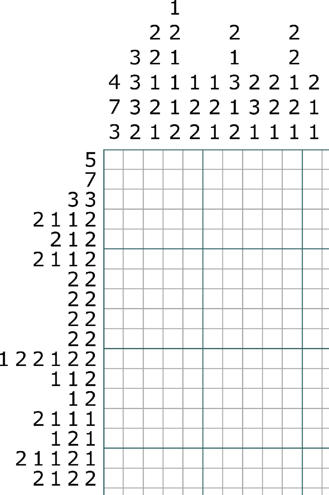

# RandomNonogram

Create random nonograms with c# language

## Summary
RandomNonogram is a basic project to create a 10*10 nonogram grid. This project is coded in C# with WPF.
The IDE used is Visual Studio from Microsoft.

The nonogram, or Picross (Nintendo) is a 2D grid where you have to color or not the boxes from the numbers located on the left and top sides of the grid. This game can be seen as an intersection between Sudoku and Minesweeper.

## Example of a nonogram grid

## Example of a RandomNonogram grid 

## Project members

* **Samuel LACHAUD** - [@samlach2222](https://github.com/samlach2222)
